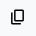

# Handbuch

* [Allgemeines](#allgemeines)
    * [Architektur](#architektur)
    * [Rollen](#rollen)
    * [Workflow](#workflow)
* [Die Oberfläche und ihre Funktionen](#die-oberfläche-und-ihre-funktionen)
    * [Anmeldung](#anmeldung)
    * [Die Breadcrump](#die-breadcrump)
    * [Mein Account](#mein-account)
    * [Metadaten Übersicht](#metadaten-übersicht)
        * [Neuerfassung](#neuerfassung)
        * [Filter Eingabe](#filter-eingabe)
        * [Statusfilter](#statusfilter)
    * [Übersicht der Metadatensätze](#übersicht-der-metadatensätze)
* [Das Editier-Formular](#das-editier-formular)
* [Zuweisen](#zuweisen)

## Allgemeines

### Architektur

Die folgenden Skizze zeigt die Architektur des Metadateneditors (MDE) im Zusammenspiel mit den anderen Komponenten

Das ActiveDirectory ist über die Software KeyCloak an das Sytem angebunden. Die Authentisierung erfolgt über KeyCloak, das die Rolle und die Kontaktdaten an den MDE übermittelt. Als Datenhaltungskomponente wird eine PostgreSQL-Datenbank eingesetzt. Zur Validierung der ISO-Metadaten sind die Testklassen der GDI-DE angebunden. Die Veröffentlichung der Metadaten erfolgt über die CSW-Schnittstelle im Geonetwork open source.

### Rollen

Folgende Rollen sind im Metadateneditor (MDE) implementiert:

* Datenhaltende Stelle - DHS
* Redakteur
* Qualitätssicherung – QS
* Administrator

Bei der Anmeldung am MDE wird die Rolle automatisch über die Software KeyCloak ermittelt. Der angemeldetet Benutzer wird mit den Rechten seiner Rolle ausgestattet und hat somit die auf diese Rolle zugeschnittenen Rechte und Funktionen.

### Workflow

Grundsätzlich ist der Workflow so konzipiert, dass ein Benutzer mit der Rolle DHS einen Metadatensatz anlegt und die notwendigen Angaben vornimmt. Anschließen übergibt er den Metadatensatz der Rolle Redakteur. Der Redakteur vervollständigt die Angaben und übergibt den Metadatensatz an die Rolle QS, die die Angaben überprüft und mit einer Freigabe zurück an die Rolle Redakteur übergibt. Der Redakteur veröffentlicht abschließend den Metadatensatz. 

Folgende Besonderheiten sind implementiert:

* Metadatensätze können auch von der Rolle Redakteur angelegt werden
* Der Rolle Administrator stehen alle Funktionen zur Verfügung

Die folgenden Skizze zeigt den gesamten Workflow:

# Die Oberfläche und ihre Funktionen

## Anmeldung

Der Benutzer meldet sich mit seinem Benutzernamen und Passwort am System an. 

Nach der Anmeldung wird dem Benutzer eine Begrüßungsseite angezeigt. Über den Link „Zur Metadaten Übersicht “ gelangt der Benutzer zur  Übersicht aller Metadaten. 

## Die Kopfzeile

Die Kopfzeile ist im MDE immer sichtbar. Sie besteht aus der Breadcrump, dem Titel und dem persönlichen Bereich. 

## Die Breadcrump

Die Breadcrump ermöglicht dem Benutzer eine direkte Navigation während der Bearbeitung von Matadaten. An erster Stelle wird das Symbol für die Begrüßungsseite angezeigt. An zweiter Stelle folgt der Link zur Übersicht der Metadaten ohne aktive Filter. Hat der Benutzer einen Metadatensatz geöffnet, wird die ID des Datensatzes als Link angezeigt. Aus der Leseansicht eines Datensatzes kann der Benutzer über diesen Link die Editieransicht des Datensatzes öffnen, sofern er über die notwendigen Berechtigungen verfügt. 
Am Ende der Breadcrump wird dem Benuzter durch „readonly“ signalisiert, wenn er sich in der Leseansicht befindet.

## Mein Account

Oben rechts in der Kopfzeile der Oberfläche wird dem Benutzer über die Schaltfläche „Mein Account“ sein Benutzername, seine Rolle sowie die verbleibende Dauer seiner Sitzung angezeigt. Zudem hat er dort die Möglichkeit, sich vom System abzumelden. 

Bei jedem Speichern bzw. bei jeder Änderung der Angaben zu einem Metadatensatz wird seine Session erneuert. Diese Mechanismus greift nach fünf Minuten Tätigkeit im MDE. Erfolgt keine aktive Tätigkeit durch eine Eingabe innerhalb der gültigen Session von 30 Minuten, wird der Benutzer vom System abgemeldet.

## Metadaten Übersicht

Die obere Zeile der Übersicht der Metadatensätze stellt die folgenden Funktionen zur Verfügung:

### Neuerfassung 

Über diesen Button öffnet sich der Dialog zum Erfassen eines neuen Datensatzes. 

Zunächst muss der Titel des neu zu erfassenden Metadatensatzes eingegeben werden. Der Benutzer kann einen bereits bestehenden Metadatensatz als Vorlage auswählen. Dafür steht im eine Suche nach Metadatensätzen zur Verfügung. Die Suche sucht über bestehende Metadatensätze, und zwar als Teil des Titels, wobei das Vorkommen der Eingabe ohne Berücksichtigung nach Groß- und Kleinschreibung gesucht wird. 

Wird ein bestehender Metadatensatz übernommen, so werden ausgewählte Felder bereits aus der Vorlage übernommen. Andere ausgewählte Felder sind zwar nicht direkt in die entsprechenden Felder übernommen worden, können aber über einen entsprechenden Button am rechten Rand  der Eingabe aus der Vorlage übernommen werden. 

Mit einem Klick auf den Button „Metadaten Anlegen“ öffnet sich das Formular zur Eingabe der Metadaten.

## Filter Eingabe

Über ein Eingabefeld kann die Anzeige der Metadatensätze eingeschränkt werden. Es wird das Vorkommen der Zeichenkette ohne Berücksichtigung von Groß- und Kleinschreibung für den Filter verwendet. 

## Statusfilter
Je nach Rolle stehen dem Benutzer vordefinierte Filter zur Verfügung. Aktive Filter werden durch ein Häkchen markiert sowie farblich hervorgehoben. Die vordefinierten Filter variieren je nach Rolle des Benutzers. 

Diese sind:

* **zu bearbeiten** – der Filter zeigt lediglich die Metadatensätze an, die dem Benutzer zugewiesen sind. 
* **Meine Metadaten** – es werden nur Metadatensätze angezeigt, bei denen der Benutzer im Team ist, d.h. er war bereits bei der Bearbeitung dieser Metadatensätze beteiligt
* **Geprüft** – der Filter zeigt nur Datensätze an, die von der Rolle QS als geprüft markiert wurden
* **jeweilige Rolle** – der Benutzer kann die Datensätze filtern, die seiner Rolle zugewiesen wurden. Dieser Filter steht der Rolle DHS nicht zur Verfügung, da die Zuweisung sich immer auf einen Benutzer bezieht.

Hinweis: Will der Benutzer aus der Einzelansicht eines Metadatensatzes zurück auf die Übersicht der Metadatensätze mit bereits festgelegten Filtern navigieren, kann er dies über den Zurück-Button des Browsers vornehmen. Alle Filter sind zudem in der URL als Parameter vorhanden, so dass er über die Bookmark-Funktion des Browsers Filterkombinationen als Lesezeichen ablegen kann.  

## Übersicht der Metadatensätze

Zunächst werden dem Benutzer alle Metadatensätze des Systems angezeigt.

Die Sortierung hängt hierbei von der Rolle und vom Status des Metadatensatzes ab. 

* alle Metadatensätze, die der Benutzer in Bearbeitung hat. Hierbei werden die Datensätze mit dem aktuellsten Bearbeitungsdatum priorisiert
* alle Metadatensätze, die der Rolle des Benutzers zugeordnet sind in einer alphabetischen Sortierung über den Titel des Metadatensatzes
* alle weiteren Metadatensätze, alphabetisch sortiert

Die Metadatensätze werden als Kacheln dargestellt, und zeigen die folgenden Angaben und Funktionsbuttons, wobei letztere von der Rolle und dem Status des Datensatzes abhängig sind:

* den Titel
* das Vorschaubild als Link zur Leseansicht
* ein Banner mit dem Datum der letzten Veröffentlichung
* Angaben zum Status des Datensatzes
* Funktionsbuttons

Die Status sind:

| Icon | Funktion | Beschreibung |
|----------|----------|----------|
|     | zu bearbeiten | der Datensatz ist bereits von dem angemeldeten Benutzer in Bearbeitung genommen worden und ist damit für andere Benutzer für eine Bearbeitung gesperrt   |
|  | Meine Metadaten   | der Benutzer hat bereits an diesem Datensatz gearbeitet und ist damit im Team der Bearbeiter. Damit kann der Datensatz ihm direkt zugewiesen werden (siehe Zuweisen von Datensätzen) |
|        | Angabe zur zugewiesenen Rolle   | die dem Datensatz zur Bearbeitung zugewiesene Rolle wird für die Rollen Redaktion und QS angezeigt  |
|    | Geprüft | der Datensatz wurde durch die Qualitätssicherung geprüft und für die Veröffentlichung freigegeben |

Folgende Funktionen sind über entsprechende Buttons an der Kachel implementiert. Diese variieren je nach Rolle und Berechtigungen des jeweiligen Benutzers.

| Icon | Funktion | Beschreibung |
|----------|----------|----------|
|     | Löschen | je nach Berechtigung kann der Benutzer einen Datensatz löschen. Es erfolgt zunächst einen Sicherheitsabfrage, die bestätigt werden muss, um den Datensatz endgültig zu löschen.    |
|  | Kommentieren   | es öffnet sich die Dialog zum kommentieren von Datensätzen |
|      | Drucken   | öffnet die Leseansicht mit aktivierter Druckfunktion des Browsers  |
|    | Bearbeiten | öffnet das Formular zum Editieren des Datensatzes |
|    | In Bearbeitung nehmen | der Benutzer kann sich je nach Berechtigung den Datensatz zur Bearbeitung zuweisen oder seine Zuweisung entfernen, so dass ein anderer Benutzer den Datensatz in Bearbeitung nehmen kann. Ein Datensatz, den sich ein Benutzer zugewiesen hat (in Bearbeitung genommen hat) ist für andere Benutzer zur Bearbeitung gesperrt. |
|    | Die Bearbeitung beenden und die Zuordnung aufheben | Der Benutzer entfernt seine Zuweisung als Bearbeiter. Damit ist der Datensatz der Rolle weiterhin zugewiesen und der Datensatz für andere Benutzer der Rolle bearbeitbar. |

## Das Editier-Formular

Das Formular zum Editieren der Metadaten besteht aus einer Vielzahl verschiedener Formlarelement-Typen. Je nach Art der Eingabe variiert der Typ und ist auf die Eingabe optimiert. Begrenzungen von Texteingaben hinsichtlich ihrer Länge werden am Formularfeld signalisiert. 

Pflichtangaben werden mit einem roten Hinweis hervorgehoben. 

Rechts neben den Eingabefeldern oder auch links oben an Eingabebereichen werden ggf. weitere Funktionen angeboten:

| Icon | Funktion | Beschreibung |
|----------|----------|----------|
|     | Hilfe | am rechten Rand des Formulars wird eine ausführliche Hilfe zu den Angaben des Formularfeldes angezeigt   |
|  | Kopieren   | die Werte können in die Zwischenablage kopiert werden, um sie ggf. in andere Formulare einzufügen |
|     |  Wert aus Vorlage übernehmen  | als Eingabehilfe können ggf. Werte übernommen werden, z.B. die Kontaktdaten des Benutzers aus den Angaben des AD bzw. KeyCloak  |
|    | Werte aus Vorlagedatensatz übernehmen | Es werden Werte aus dem Datensatz, der als Vorlage diente, übernommen |
|    | Löschen | es können Eingabebereiche entfernt werden, nachdem eine Sicherheitsabfrage bestätigt wurde |

Das Eingabeformular ist in vier Bereiche unterteilt:
1. Basisangaben
2. Einordnung
3. Zeitliche und Räumliche Angaben
4. Weitere Angaben
5. Dienste

Diese werden als „Karteireiter“ unterhalb des Titels angezeigt und können dort direkt angesteuert werden. Unterhalb der Beschriftung des jeweiligen Reiters signalisiert ein blauer Balken, inwieweit die Vollständigkeit der Angaben erreicht ist. Hat der Balken 100 Prozent der notwendigen Angaben erreicht, färbt er sich grün. Ein Überfähren des Balkens mit der Maus zeigt den prozentualen Erfüllungsstand der Pflichtangaben.

Pflichtangaben sind abhängig von zuvor getätigten Angaben. So können je nach INSPIRE Relevanz  oder auch Angaben zu Diensten weitere Angaben notwendig sein. 

Unterhalb des Formulars werden in einer Fußzeile die Folgenden Funktionen angeboten:

| Icon |  Beschreibung |
|----------|----------|
|     | es können Kommentare zum jeweiligen Metadatensatz hinterlegt werden. Der jeweils letzte Datendatz kann wieder gelöscht werden  |
|     | wechselt in den jeweils nächsten oder vorhergehenden Karteireiter  |
|   | erzeugt einen Export aller ISO-Metadatendokumente und bietet diese in einen Zip-Archiv zum Download an  |
|   | prüft die Eingaben gegen die Testklassen der GDI-Testsuite und gibt die Ergebnisse aus  |
|   | Ermöglicht des Zuweisen des Metadatensatzes einer Rolle oder auch einem bestimmten Benutzer. Im Falle der QS kann hier auch der Metadatensatz als geprüft markiert werden.  |
|   |  Ein von der QS als geprüft markierter, vollständig ausgefüllter Metadatensatz kann Veröffentlicht werden. Dies bedeutet das der Metadatensatz im GeoNetwork opensource als Metadatenkatalog veröffentlicht wird. |

## Zuweisen

Über die entsprechende Schaltfläche kann ein Metadatensatz einer Rolle oder auch einem bestimmten Benutzer der jeweiligen Rolle zugewiesen werden. Die Optionen der Zuweisung sind je nach Rolle unterschiedlich.
    
* DHS – kann nur einen Metadatensatz allgemein  an die Rolle Redakteur übergeben
* Redakteur
    * kann seine Zuordnung entfernen
    * kann nur an einen speziellen Benutzer der Rolle DHS den Metadatensatz übergeben. 
    * kann den Metadatensatz an einen speziellen Benutzer der rolle QS übergeben, falls es bereits Teammitglieder der Rolle QS gibt
    * kann an die Rolle QS übergeben
* QS
    * kann den Metadatensatz an die Rolle Redakteur übergeben
    * kann den Metadatensatz an einen Team-Member der Rolle Redakteur übergeben
    * kann den Status Geprüft setzen
* Administrator – dem Administrator stehen alle Möglichkeiten inklusive der Markierung als geprüft zur Verfügung

